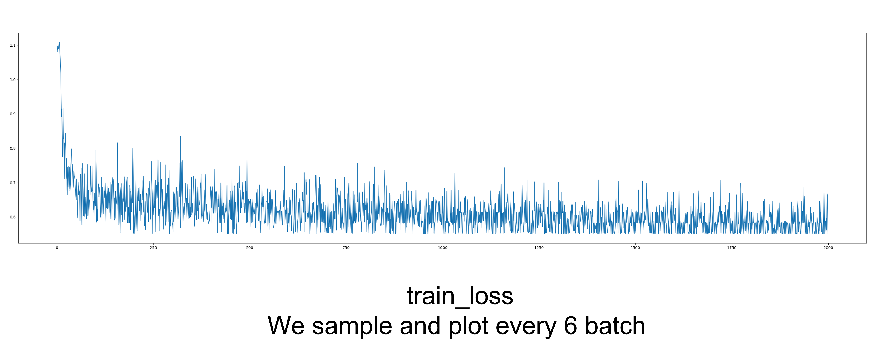

# A ML model in tissue section classification

## Introduction

Machine Learning models have shown state-of-the-art power in multiple tasks like classificaiton and regression. We trained a [AlexNet]( https://doi.org/10.1145/3065386) on a dataset of lung tissues to identify whether there is any focus in the tissues. Our model showed great performance in the classificaiton task.

### Clinical Application

In hospitals, the tissue section will be sent to pathology department before the doctor judge wheter there exists the focus. Thus, the accuracy of the pathological test depends not only on the proficiency of the pathology doctor but the size of sample. For example, it is hard for human to distinguish the focus in a large scale of normal cells, while the local view, lacking of a global analysing, the sample can be easily classified by naked eyes with the help of optical microscope. To address this trade-off, we can make use of maching learning model which can distinguish the focus fast while keeping a high level of accuracy. And that is the purpose of our experiment on ML model in tissue section classification. 

## Experiment

### Dataset

We use public data in Alibaba Cloud. In the dataset there are three types of data: Lung benign tissue, Lung adenocarcinoma abd Lung squamous cell carcinoma. Each class has 5000 samples, summing up to 15000. We randomly divided every class so that 80% of it is used to train the machine learning model and the left 20% is used to test.

### Model

We use AlexNet as the framework of the model. Thus, there are 5 convolution layers (shown in figure below) after which there are 4 fully connected layers. We use `relu` as the activation function in every convolution layer and `maxpooling` after convolution. In the output layer, we use `softmax` function as the last activation function. 

### Result

We ran 30 epoches to train the model. The test loss is shown in **Epoch_test_loss**  and the train loss is shown in **train_loss**. To assess the model's performance, we calculate the accuracy on test data. We find that out model converged to 0.97 in accuracy. 

## Summary

We built a maching learning model and successfully train it to classify the focus in lung tissue. Our model showed a high accuracy of 97%.  
